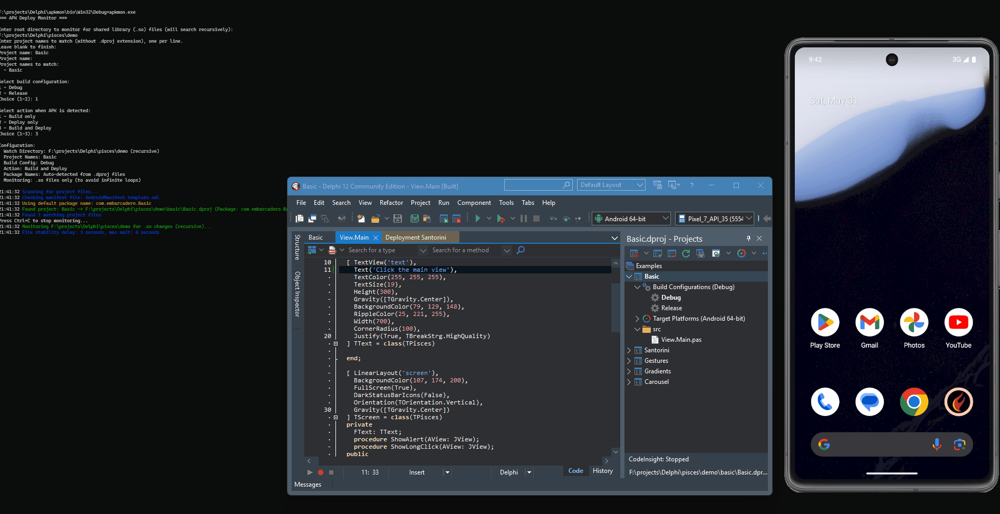
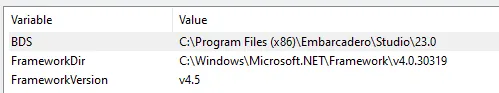

# 👾apkmon - Delphi to Android APK Deploymentf

A Windows console application that monitors directories for Android shared library (.so) file changes and automatically builds/deploys APK files to Android emulators.



## Notes

- Only monitors `.so` files to avoid infinite deployment loops. If this happens, maybe your project is rebuilding itself, or something else is causing the .so files to be created consecutively. It should only build when the .so files flag `FILE_ACTION_ADDED` is detected.
- For the first build, you need to build the project manually via `Project > Deployment > Deploy`, so Delphi can insert set `Deploy` options in the `.dproj` file.
- Automatically detects Android emulators using `adb devices`
- Supports multiple project monitoring simultaneously

## Setup

- Windows OS
- Delphi/RAD Studio with Android development support
- Android SDK with ADB in PATH
- Running Android emulator

With Android Studio and .NET Framework installed, add these directories to your System PATH environment variable:

```
C:\Users\<your_user>\AppData\Local\Android\Sdk\emulator
C:\Users\<your_user>\AppData\Local\Android\Sdk\platform-tools
C:\Windows\Microsoft.NET\Framework\v4.0.30319
```

Add these environment variables to your user or system variables:

- **BDS**: `C:\Program Files (x86)\Embarcadero\Studio\23.0`
- **FrameworkDir**: `C:\Windows\Microsoft.NET\Framework\v4.0.30319`
- **FrameworkVersion**: `v4.5`



This ensures that MSBuild, adb, and other tools are accessible via the terminal.

## How It Works

1. Scans for `.dproj` files matching your project names
2. Extracts package names from project files or AndroidManifest.template.xml
3. Monitors for `.so` file changes using Windows directory change notifications
4. Waits for file stability before processing
5. Builds project using MSBuild (if configured)
6. Finds corresponding APK file
7. Clears app data and installs APK to emulator
8. Starts the application
