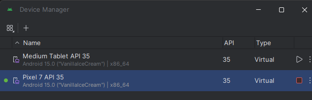

# 👾apkmon - Delphi to Android APK Deployment

A Windows console application that monitors directories for Android shared library (.so) file changes and automatically builds/deploys APK files to Android emulators.


## Notes

- Only monitors `.so` files to avoid infinite deployment loops. If this happens, maybe your project is rebuilding itself, or something else is causing the .so files to be created consecutively. It should only build when the .so files flag `FILE_ACTION_ADDED` is detected.
- On the first time, you need to build the project manually via `Project > Deployment > Deploy`, so Delphi can insert set `Deploy` options in the `.dproj` file.
- Automatically detects Android emulators using `adb devices`
- Supports multiple project monitoring simultaneously and multiple devices deployment (physical/emulator)

## Setup

- Windows OS
- Delphi/RAD Studio with Android development support
- Android SDK with ADB in PATH
- Running Android emulator

With Android Studio and .NET Framework installed, add these directories to your System PATH environment variable:

```
C:\Users\<your_user>\AppData\Local\Android\Sdk\emulator
C:\Users\<your_user>\AppData\Local\Android\Sdk\platform-tools
C:\Windows\Microsoft.NET\Framework\v4.0.30319
```

Add these environment variables to your user or system variables:

- **BDS**: `C:\Program Files (x86)\Embarcadero\Studio\23.0`
- **FrameworkDir**: `C:\Windows\Microsoft.NET\Framework\v4.0.30319`
- **FrameworkVersion**: `v4.5`


This ensures that MSBuild, adb, and other tools are accessible via the terminal.

## Notice

Delphi FMX ships only ARM/ARM64 libs, so x86/x86_64 devices won’t run it. However, for emulators, both ARM/ARM64 or x86_64 are supported. Keep an ARM/x86_64 emulator (Google APIs ARM image) or a physical ARM device running and let apkmon target that.


